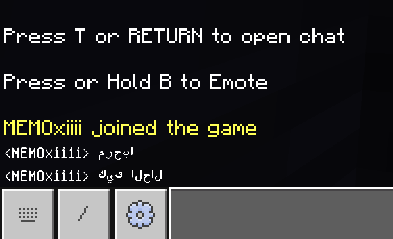
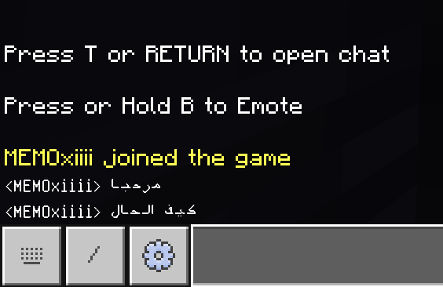

ArabicFixer is a PocketMine-MP plugin designed to enhance Arabic text support in Minecraft Bedrock Edition servers. Due to Bedrock's lack of native Arabic language support, chat messages often appear reversed and with incorrect letter forms. This plugin fixes these issues by:

- Correcting Arabic letter forms (initial, medial, final, isolated) based on context.
- Reversing Arabic text to display in the correct right-to-left direction.
- Supporting special cases like "الله" and "صلى" with proper Unicode replacements.

# FROM

# TO

هي إضافة (بلوجن) لـ PocketMine-MP تهدف إلى تحسين دعم اللغة العربية في خوادم ماين كرافت إصدار البيدروك. نظرًا لعدم دعم إصدار البيدروك للغة العربية بشكل أصلي، تظهر الرسائل في الدردشة معكوسة وبأشكال حروف غير صحيحة. هذه الإضافة تعالج هذه المشاكل من خلال:

- تصحيح أشكال الحروف العربية (متصلة، منفصلة، في البداية، الوسط، أو النهاية) بناءً على السياق.
- عكس النصوص العربية لتظهر بالاتجاه الصحيح من اليمين إلى اليسار.
- دعم الحالات الخاصة مثل "الله" و"صلى" باستبدالها برموز يونيكود صحيحة.
