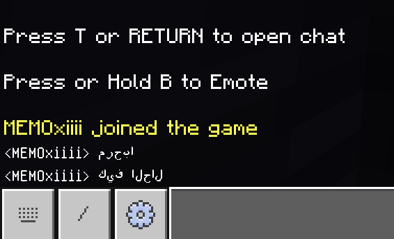
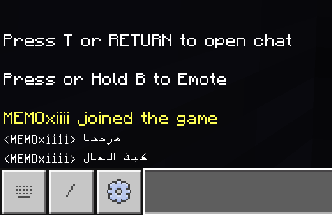

# ArabicFixerPE

ArabicFixerPE is a PocketMine-MP plugin that improves Arabic text rendering in Minecraft Bedrock servers.

Bedrock clients do not handle Arabic shaping and RTL (right-to-left) direction correctly in many chat contexts. This plugin fixes that while staying compatible with chat/rank format plugins.

## Before / After

### Before


### After


## Features

- Corrects Arabic letter shaping based on context (isolated, initial, medial, final).
- Fixes Arabic text direction for better readability.
- Supports special Arabic forms such as `الله` and `صلى`.
- Works with mixed messages (Arabic + English/numbers/symbols).
- Preserves rank/chat formatting from other plugins by only editing message content.
- Supports sign text correction.

## Compatibility

- PocketMine-MP API: `5.0.0+`
- Tested with PocketMine-MP `5.41.0`
- Soft-supported chat/rank plugins:
	- `RankSystem`
	- `ChatPerms`

ArabicFixerPE runs safely even if these plugins are not installed.

## Installation

1. Download `ArabicFixerPE.phar` from releases or build it locally.
2. Put the file inside your server `plugins/` folder.
3. Restart the server.
4. Edit config at `plugin_data/ArabicFixerPE/config.yml` if needed.

## Configuration

Default file: `resources/config.yml`

```yaml
chat-enabled: true
sign-enabled: true
```

- `chat-enabled`
	- `true`: apply Arabic correction in chat.
	- `false`: disable chat correction.
- `sign-enabled`
	- `true`: apply Arabic correction on sign updates.
	- `false`: disable sign correction.

## How It Handles Chat

- Pure Arabic text: corrected and reversed as RTL-friendly output.
- Mixed text (rank prefix + Arabic): Arabic segments are corrected in a compatibility-safe way to avoid breaking external chat formatters.

This design keeps integration stable with rank/chat plugins that format `PlayerChatEvent`.

## Troubleshooting

- If chat format/rank disappears:
	- Ensure you are using the latest ArabicFixerPE build.
	- Make sure only one ArabicFixerPE `.phar` exists in `plugins/`.
- If server fails on startup with YAML errors:
	- Re-download the plugin file.
	- Check `plugin.yml` indentation (spaces, not tabs) if you modified source.

## Arabic Description (الوصف بالعربية)

ArabicFixerPE هي إضافة لـ PocketMine-MP لتحسين عرض النص العربي في سيرفرات ماينكرافت بيدروك.

بسبب محدودية دعم العربية في بيدروك، قد تظهر الرسائل العربية باتجاه أو تشكيل غير صحيح. الإضافة تقوم بـ:

- تصحيح أشكال الحروف العربية حسب السياق.
- تحسين اتجاه النص العربي ليظهر بشكل أوضح.
- دعم حالات خاصة مثل `الله` و`صلى`.
- دعم الرسائل المختلطة (عربي + إنجليزي/أرقام/رموز).
- الحفاظ على تنسيق الرتب والدردشة مع إضافات مثل `RankSystem` و`ChatPerms`.

### الإعدادات

ملف الإعدادات:

`plugin_data/ArabicFixerPE/config.yml`

- `chat-enabled`: تفعيل/تعطيل تصحيح الدردشة.
- `sign-enabled`: تفعيل/تعطيل تصحيح اللافتات.

## Contributing

Pull requests and issues are welcome.

If you report a bug, include:

- PocketMine-MP version
- ArabicFixerPE version
- Other chat/rank plugins installed
- Example message and expected output

## License

This project is licensed under the MIT License. See `LICENSE`.
